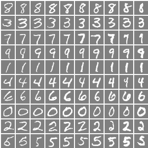
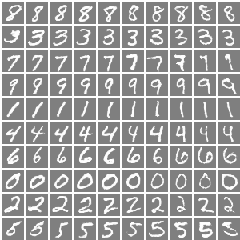

# infoGAN-pytorch
Implementation of infoGAN using PyTorch

## Results
**Catagorical variable(K) and continue variable (c1)** 
Row represents categorical variable from K = 0 to K = 9 (top to buttom) to characterize digits. 
Column represents continue variable (c1) (Width) varying from -1 to 1(left to right). 

**Catagorical variable(K) and continue variable (c2)** 
Row represents categorical variable from K = 0 to K = 9 (top to buttom) to characterize digits. 
Column represents continue variable (c2) (Rotation) varying from -1 to 1(left to right). 

